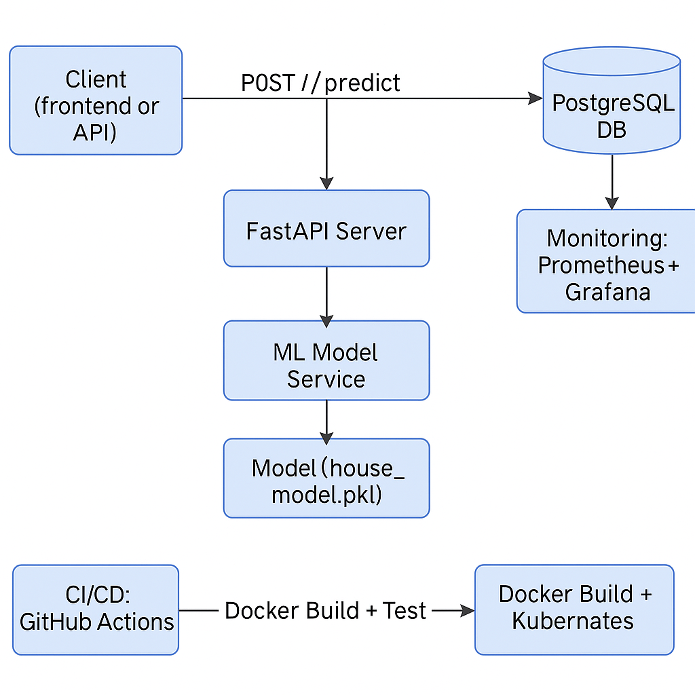

# MLOps House Price Prediction

A production-ready, containerized machine learning microservice that predicts house prices using scikit-learn. Built with FastAPI, Docker, and a full MLOps pipeline including CI/CD, monitoring, and database integration.

---

## Features

- Traditional ML model (Linear Regression)
- REST API for real-time predictions
- FastAPI-based model serving
- Containerized with Docker & Docker Compose
- PostgreSQL integration (for data storage or logging)
- CI/CD pipeline with GitHub Actions
- Monitoring with Prometheus + Grafana

---

## System Architecture

This diagram shows the key components and data flow in the MLOps House Price Prediction service:

<p align="center">
  
</p>

---

## Project Structure

```
mlops-house-price-service/
├── app/                  # FastAPI application code
│   ├── main.py           # API routes
│   ├── model.py          # Load model and predict
│   └── schema.py         # Request/response models
├── model/                # ML training pipeline
│   ├── train.py          # Script to train and save model
│   └── house_model.pkl   # Trained model
├── db/                   # Optional DB setup
│   └── init.sql          # Initial SQL schema
├── Dockerfile            # Docker build for FastAPI app
├── docker-compose.yml    # Multi-service orchestration
├── requirements.txt      # Python dependencies
├── .github/workflows/    # CI/CD workflows
│   └── ci-cd.yml
└── README.md             # Project documentation
```

---

## Tech Stack

- **ML Framework**: scikit-learn
- **API Framework**: FastAPI
- **Database**: PostgreSQL (via Docker)
- **Monitoring**: Prometheus + Grafana
- **Containerization**: Docker, Docker Compose
- **CI/CD**: GitHub Actions

---

## Setup Instructions

### 1. Clone the Repo

```bash
git clone https://github.com/your-username/mlops-house-price-service.git
cd mlops-house-price-service
```

### 2. Train the Model

```bash
cd model
python train.py
```

### 3. Build and Run with Docker

```bash
docker-compose up --build
```

The FastAPI app will be available at `http://localhost:8000/docs`.

---

## API Endpoint

### `POST /predict`

**Request:**

```json
{
  "MedInc": 8.3,
  "HouseAge": 41,
  "AveRooms": 6,
  "AveBedrms": 1,
  "Population": 850,
  "AveOccup": 3,
  "Latitude": 34.2,
  "Longitude": -118.5
}
```

**Response:**

```json
{
  "predicted_price": 312450.0
}
```

---

## CI/CD Pipeline

- Lint and test the code on push
- Build Docker image
- Push to Docker Hub (optional)
- Auto-deploy via Docker Compose or to a cloud instance

---

## Monitoring

- **Prometheus** scrapes FastAPI metrics
- **Grafana** visualizes:
  - Request rates
  - Response times
  - Container health

> Visit Grafana at `http://localhost:3000` (default credentials: admin / admin)

---

## License

This project is licensed under the [MIT License](LICENSE).

---

## Acknowledgments

- [scikit-learn](https://scikit-learn.org/)
- [FastAPI](https://fastapi.tiangolo.com/)
- [Docker](https://www.docker.com/)
- [Prometheus](https://prometheus.io/)
- [Grafana](https://grafana.com/)
